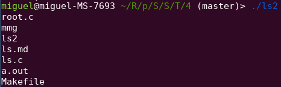
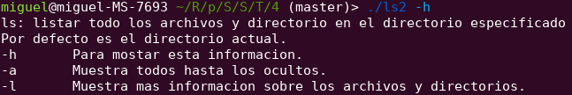
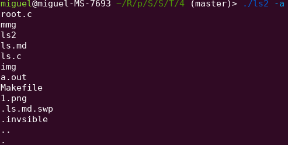
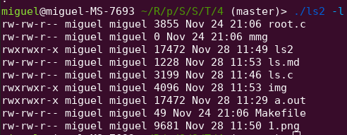
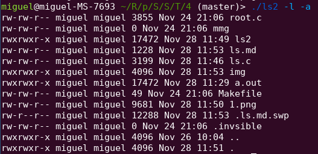

# Miguel Estevez
## 2017-0200

<div align="center" style="font-size:40px">Ls</div>

Para la implemetacion de este comando se utilizo la estructura dirent de c:

struct dirent:
- char d_name[]: nombre del archivo
- char d_fileno: numero serial del archivo
- char d_namlen: largo del nombre del archivo
- char d_type: tipo del archivo

Tambien de la estructura stat

```c
struct stat {
	dev_t st_dev;
	ino_t st_ino;
	mode_t st_mode;
	nlink_t st_nlink;
	uid_t st_uid;
	gid_t st_gid;
	dev_t st_rdev;
	off_t st_size;
	time_t st_atime;
	time_t st_mtime;
	time_t st_ctime;
	blksize_t st_blksize;
	blkcnt_t st_blocks;
	mode_t st_attr;
}; 
```

De aqui se pudo conseguir informacion de los archivos como: los permisos, la ultima fecha de modificacion, el tamaño y el dueño del archivo.

Estructura implemetada para los flags.
```c
typedef struct {
    short all;
    short allInfo;
} Flag;
```

### Flags implemetados:
1. **-a** para mostrar los archivos ocultos.
2. **-h** para mostrar los flags y que hace el comando.
3. **-l** para mostrar mas informacion sobre los archivos.

### Corrida

**ls**



**ls -h**


**ls -a**




**ls -l**




**ls -l -a**

