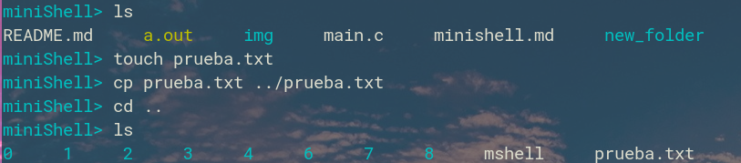
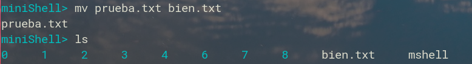
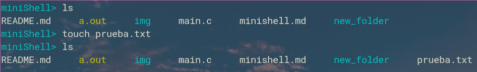
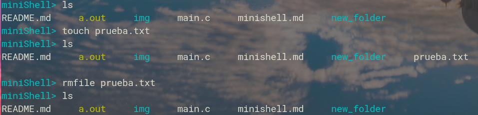
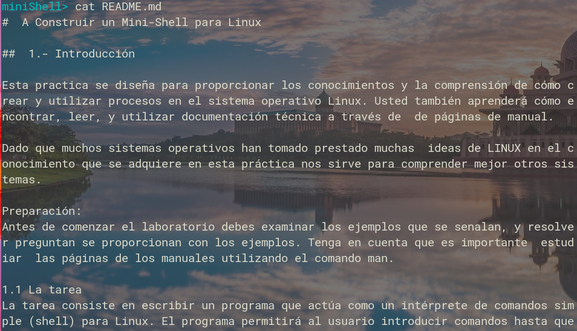
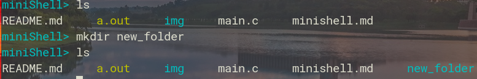
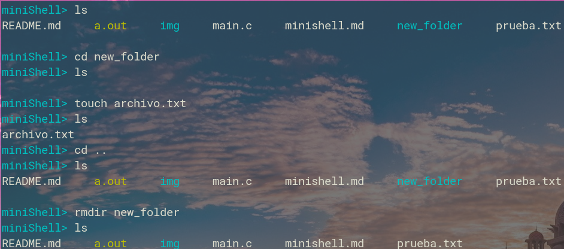
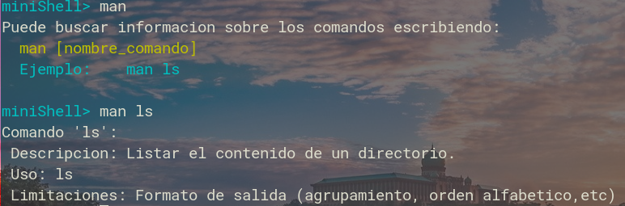
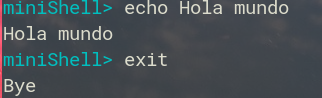

## Miguel Estevez
## 2017-0200

# Minishell

#### Lista de comandos implementados:
1. cd
1. pwd
2. clear
3. cp
4. exit
5. help
6. ls
7. man
1. mkdir
1. rmdir
1. rmfile
1. mv
1. cat
1. date

#### cd

```c
int comando_cd(char **arg) {
    if(arg[1] == NULL) {
        printf("Error: Cantidad insuficiente de argumentos \n Ver man help");
    } else {
        if(chdir[arg[1] != 0) {
            printf("Error: Fallo el comando 'cd'\n");
        }
    }
    return 0;
}
```

### pwd
```c

int comando_pwd(char **arg){
    if(arg[1] != NULL) { 
      printf("Error: El comando 'pwd' no acepta ningun argumento.\n");
      return 0;
    }
    char cwd[1024];
    chdir("/path/to/change/directory/to");
    getcwd(cwd, sizeof(cwd));
    printf("%s\n", cwd);
    return 0;
}
```


### cp
```c
int comando_cp(char **arg){
  /* Uso:   cp [nombre_archivo] [/destino/nombre_archivo_copia] */

  FILE *fuente,*destino;
  char c;

  if(arg[2]== NULL) {  //cantidad argumentos < 3
    printf("Error: Cantidad insuficiente de argumentos\n");
    return -1;
  } else if(arg[1] == NULL) {
      printf("Error: Cantidad de argumentos\n cp [fuente] [destino]");
  }
  fuente=fopen(arg[1],"r"); //Se abre el archivo fuente para lectura
  destino=fopen(arg[2],"w");  //Se abre el archivo destino para escritura
  if(fuente==NULL || destino==NULL) {
    printf("Error: Fallo en el archivo fuente o destino\n");
    return 0;
  }
  while((c=fgetc(fuente))!=EOF) {  //Se lee el archivo fuente caracter a caracter
    fputc(c,destino);  //Se escribe en el archivo destino
  }
  fclose(fuente);
  fclose(destino);  //Se cierran ambos archivos

  return 0;
}
```



### mv
```c
int comando_mv(char **arg) {
    if(comando_cp(arg) == 0) {
        printf("%s\n",arg[1]);
        remove(arg[1]);
    }
    return 0;
}
```




### touch
```c
int comando_touch(char **arg) {
    if (arg[1] == NULL) {
        printf("Error: Cantidad insuficiente de argumentos\n"); 
    } else {
        FILE* out = fopen(arg[1],"w");
        fclose(out);
    }
    return 0;
}
```



### rmfile

```c
int comando_rmfile(char **arg) {
  if (arg[1]==NULL) {
    printf("Error: El comando 'rmfile' debe tener un argumento\n");
  } else if (arg[2]!=NULL) {
    printf("Error: El comando 'rmfile' no puede tener mas de un argumento\n");
  }

  if(remove(arg[1]) == -1)
        perror("Error: No se puedo eliminar el archivo");
  return 0;
}
```



### cat
```c
int comando_cat(char **arg) {
    if(arg[2] != NULL) {
        printf("Solo un argumento");
        return 0;
    }

    if(arg[1] == NULL) {
        printf("Se necesita un argumento");
        return 0;
    }

    FILE* fuente;
    fuente = fopen(arg[1],"r");

    if(fuente == NULL) {
        printf("Archivo: %s no existe\n", arg[1]);
        return 0;
    }
    char c;

    while((c=fgetc(fuente))!=EOF) {  //Se lee el archivo fuente caracter a caracter
        printf("%c",c);
    }
    fclose(fuente);
    return 0;
}
```


### date
```c
int comando_date(char **arg) {
    if(arg[1] != NULL) {
        perror("No acepta ningun argumento");
        return 0;
    }
    time_t t = time(NULL);
    struct tm tm = *localtime(&t);
    printf("%d-%02d-%02d %02d:%02d:%02d\n", tm.tm_year + 1900, tm.tm_mon + 1, tm.tm_mday, tm.tm_hour, tm.tm_min, tm.tm_sec);
    return 0;
}
```


### mkdir
```c
int comando_mkdir(char **arg) {
    if (arg[2] != NULL) {
      printf("Error: El comando 'mkdir' solo acepta un argumento\n");
      return 0;
    }
    char tmp[256];
    char *p = NULL;
    size_t len;

    snprintf(tmp, sizeof(tmp),"%s",arg[1]);
    len = strlen(tmp);
    if(tmp[len - 1] == '/') {
       tmp[len - 1] = 0;
    }
    for(p = tmp + 1; *p; p++) {
      if(*p == '/') {
       *p = 0;
        mkdir(tmp, S_IRWXU);
        *p = '/';
      }
    }
    
    mkdir(tmp, S_IRWXU);

  return 0;
}
```



### rmdir
```c
int comando_rmdir(char **arg) {
    char* dir = arg[1];
    int ret = 0;
    FTS *ftsp = NULL;
    FTSENT *curr;

    if (arg[1]==NULL) {
        printf("Error: El comando 'rmdir' debe tener un argumento\n");
    } else if (arg[2]!=NULL) {
        printf("Error: El comando 'rmdir' no puede tener mas de un argumento\n");
    }

    /* Casting necesario en C porque fts_open() toma un "char * const *, en vez de "const char * const *", el 
    cual solamente esta permitido en C++. La llamada a fts_open() no modifica al argumento */
    char *files[] = { (char *) dir, NULL };

    // FTS_NOCHDIR  - Evitar cambiar el cwd,lo que podria causar un comportamiento inesperado en multithreading
    // FTS_PHYSICAL - Previene eliminar archivos por fuera del directorio especificado
    // FTS_XDEV     - No cruzar los limites del sistema de archivos
    ftsp = fts_open(files, FTS_NOCHDIR | FTS_PHYSICAL | FTS_XDEV, NULL);
    if (!ftsp) {
        fprintf(stderr, "%s: Fallo en fts_open: %s\n", dir, strerror(errno));
        ret = -1;
        goto finish;
    }

    while ((curr = fts_read(ftsp))) {
        switch (curr->fts_info) {
        case FTS_NS:
        case FTS_DNR:
        case FTS_ERR:
            fprintf(stderr, "%s: Fallo en fts_read: %s\n",
                    curr->fts_accpath, strerror(curr->fts_errno));
            break;

        case FTS_DC:
        case FTS_DOT:
        case FTS_NSOK:
            // Codigo no alcanzado a menos que FTS_LOGICAL, FTS_SEEDOT, o FTS_NOSTAT hayan sido 
            //pasados a fts_open()
            break;

        case FTS_D:
            // No hacer nada. Se necesita busqueda depth-first, entonces los directorios son
            // eliminados en FTS_DP
            break;

        case FTS_DP:
        case FTS_F:
        case FTS_SL:
        case FTS_SLNONE:
        case FTS_DEFAULT:
            if (remove(curr->fts_accpath) < 0) {
                fprintf(stderr, "%s: Error: Fallo el comando 'rmdir': %s\n",
                        curr->fts_path, strerror(errno));
                ret = -1;
            }
            break;
        }
    }

      finish:
          if (ftsp) {
              fts_close(ftsp);
          }

    return ret;
      
}
```


### man


### echo y exit

