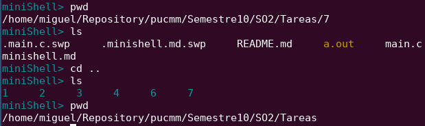
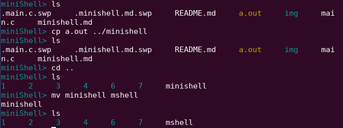

# Minishell

#### Lista de comandos implementados:
1. cd
1. pwd
2. clear
3. cp
4. exit
5. help
6. ls
7. man
1. mkdir
1. rmdir
1. rmfile
1. mv
1. cat
1. date

#### cd

```c
int comando_cd(char **arg) {
    if(arg[1] == NULL) {
        printf("Error: Cantidad insuficiente de argumentos \n Ver man help");
    } else {
        if(chdir[arg[1] != 0) {
            printf("Error: Fallo el comando 'cd'\n");
        }
    }
    return 0;
}
```

### pwd
```c

int comando_pwd(char **arg){
    if(arg[1] != NULL) { 
      printf("Error: El comando 'pwd' no acepta ningun argumento.\n");
      return 0;
    }
    char cwd[1024];
    chdir("/path/to/change/directory/to");
    getcwd(cwd, sizeof(cwd));
    printf("%s\n", cwd);
    return 0;
}
```



### cp
```c
```

### mv
###



### rm
###
