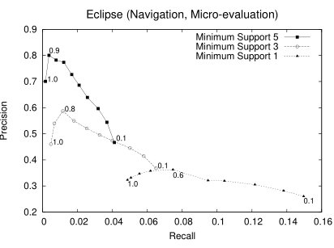
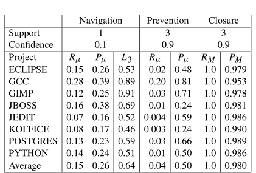
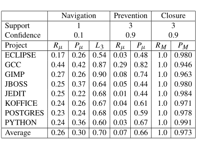

## Miguel Estevez
### 2017-0200
Recomendación y predicción de posibles cambios:
* Usan técnicas de minería de datos para obtener reglas de asociación a partir de las historias de versión. 
* Evaluar la habilidad de predecir cambios futuro o que falte.

El servidor rose lee los archivos de version, agrupa los cambios en transacciones, mina las transacciones por reglas la cuales describen las implicaciones entre entidades de software. Cuando el cliente rose consulta el conjunto de reglas aplicables y hace las recomendaciones apropiadas para futuros cambios.

Una entidad es una triada (f,c,i), donde f es el nombre del archivo afectado, c es la categoría sintáctica del componente afectado y i es el identificador del componente afectado.

Se adquieren las transacciones de los CVS.

Para inferir una transacción se usó sliding window donde dos cambios consecuentes del mismo autor es parte de una transacción si solo paso a lo mucho 200 segundos.

Para la validación de una regla se usó confidence y support
Se utiliza a priori pero se usaron algunas optimización como son: restricción de antecedentes( sólo se buscaban las reglas que estaba relacionada con la situación)y solo se utilizaba un consecuente. Con lo que se consiguió un 0.5s tiempo de corrida en promedio.

Para evaluar se utilizaron 8 grandes proyectos de código abierto, donde se tomaron las últimas 1000 transacciones y se trató de predecirlas desde el historial anterior.

Para la evaluación se tomaron en cuentas varios aspectos:
* Navegación por el código.
    * Se obtuvo 15% recall promedio y 26% de precisión promedio. 
* Prevención de errores.
    * Se obtuvo una precisión promedio de 50% y un recall de 4%
* Cierre
    * Se obtuvo una precisión promedio de 98% y un recall de 100%
* Granualidad
    * Al minar a los archivos en vez de las variables o funciones se obtuvo un mejora en el modelo.

Uno puede o tener recomendaciones precisas o muchas recomendaciones pero no ambas.

En mi opinión, esta investigación es muy interesante ya que me sorprendió en el área de desarrollo, no había pensado en esta posible aplicación de la minería de datos. Aunque los resultados no fueron muy altos con excepción del cierre, fue interesante ver como un poco el cambio del enfoque hizo que subiera considerable la precisión y el recall. Haciendo que en este problema haya una dualidad de la granularidad con la precisión y el recall. 

