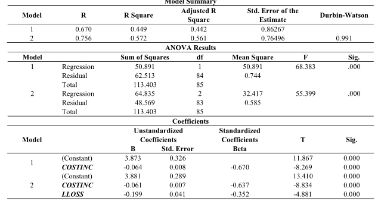
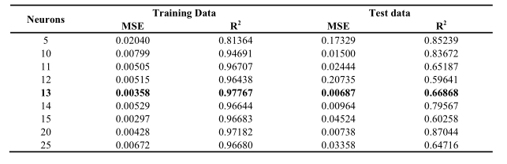
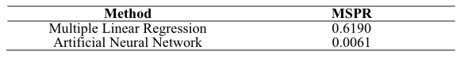

# Miguel Estevez (2017-0200)

## Resumen:
Uso de redes neuronales y múltiple regresión lineal para predecir el rendimiento de los bancos en Malasia.

## Puntos Importantes:
* La data proviene de 13 bancos de Malasia entre los años 2001-2006 elegidos aleatoriamente de la base de datos BANKSCOPE.
* El rendimiento de un banco se puede representar con el retorno en activos (el que se usó en este paper), retorno en capital y el retorno en depósitos.
* En todos los estudios anteriores que comparan los métodos tradicionales estadísticos con la inteligencia artificial, esta última le gana a todos.
* Variables a utilizar para calcular el ROA(retorno en activos):
    * LIQ = proporción de préstamo-activos como medida de la liquidez
    * LLOS = proporción de pérdida de provisión con préstamo como medida de riesgo de crédito
    * COSTINC = relación costo-ingreso
    * $SIZE_i$ = Tamaño del banco basado en su total de activos
    * $CONC_i$ =  proporción de concentración, calculado al coger los 3 más grandes bancos dividido por el total de activos
    * $CPI_i$ = Índice de precios al consumidor 
    * $GDP_i$ = grosor de producto doméstico
    * $\epsilon_i$ = termino de error

* De los 96 data que fueron coleccionados (6 años X 13 bancos seleccionados), 86 se usaron para el training set y 10 para el testing set. 

* La función de activación que se utilizó es la función sigmoid :
$$
\phi(v) = \frac{1}{1+e^{-v}}
$$

### Resultados de la regresion lineal multiple:

Al coger las 7 variables, tabla 2.

* Las variables más significativas eran: riesgo en crédito y relacion costo-ingreso.

$B_0 = 3.881, b_2 = -0.199$ y $B_4 = -0.061$ 

La ecuacion de regresion lineal multiple:
$$
    ROA_i = B_0 + B_1LIQ_i + B_2LLOS_i + B_3SIZE_i + B_4COSTINC_i + B_5COC_i + B_6GDP_i + B_7CPI_i + \epsilon_i\\
    i= 1,..,n

$$

La funcion regresion robusta es $3.423-0.4197LLOSS - 0.0288COSTINC$

### Resultado de la red neuronales:
Se utilizó una red de multicapa de perceptrón con una capa oculta y 7 entradas, que corresponden a las 7 variables del estudio. Aquí se compara los resultados cambiando el número de neuronas donde el 13 es el mejor.

Para comparar ambos resultados se utilizó la media de error predecido donde la red neuronal gana por mucho a la regresión múltiple, como se ve a continuación:

## Opinion
A mi parecer este paper es muy interesante ya que demuestra cómo las redes neuronales pueden implementarse en muchas áreas, en este caso las finanzas y ganarle a las técnicas que se llevan utilizando desde hace un tiempo en esas áreas. Lo cual podría llevar a pensar en otras áreas de conocimiento donde se pudiera implementar estos algoritmos para optimizar los resultados. Una de las desventajas que son mencionadas en esta investigación es que vieron que para encontrar el número óptimo de neuronas se toma cierto tiempo ya que se deben hacer varias iteraciones del mismo algoritmo para encontrarlo. Pero esto también puede ser por los equipos que se utilizaron ya que esta investigación es del 2009 y el panorama de la computación ahora es muy diferente a lo que había en esos tiempos.
