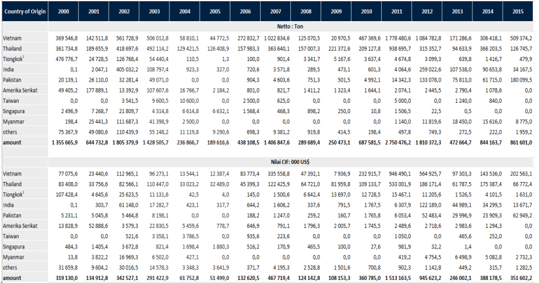
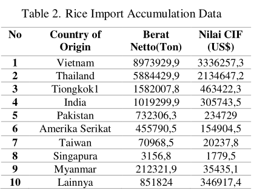
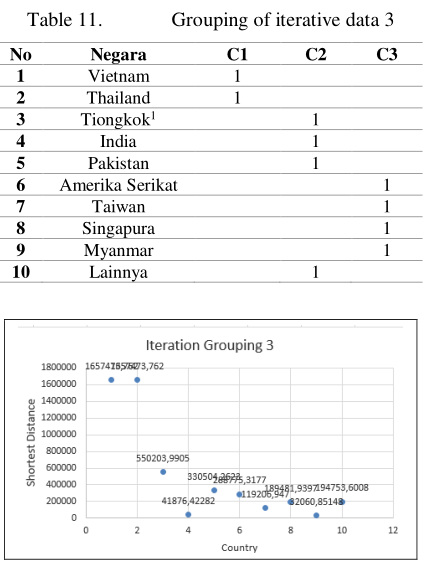

## Miguel Estevez
## 2017-0200

Uso de k-means clustering para sacar informacion sobre la imortaciones de arroz en indonesia.

### Puntos importantes.

- La data usada en este estudio es la data de importaciones de arroz por pais de origen desde 2000-2015 donde se encuentran: Vietnam, Tailandia, China, India, Pakistan, Estados Unidos, Taiwan, Singapur, Myanmar y otros.

- Las variables usadas fueron: la cantidad de arroz importado, valor de las importaciones.

- El estudio se dividio en 4 etapas: recoleccion de data, procesamiento de data, clustering y analisis.

- Para el algoritmo de clutering se calculo la distancia euclideana.

- Se utilizo rapidMiner. 

- Solo se usaron 3 clusters

- La data:

- Al acumular todos los datos se obtuvo:

La posicion inicial de los centroides fue esta:

Luego de 3 iteraciones del algoritmo se llego a su conclusion y asi fue como quedaron los resultados:

