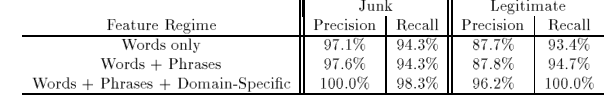
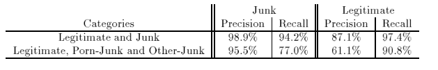

# A Bayesian Approach to Filtering Junk E-mail
## Miguel Estevez
## 2017-0200

## Resumen:
Investigación del uso del algoritmo de bayes para el filtrado de email. Donde se realizaron 3 pruebas: el primero con 2 clases, el segundo con 3 y el tercero un caso real.

## Puntos importantes:

* Se utilizó el modelo "Vector Space" para representar los emails. El cual es un vector binario que denota cuales palabras están presente y cuáles no.

* Ciertas frases como "FREE" o "be over 21" pueden indicar que pueda ser un email basura.

* Se toma en cuenta que algunos dominio como el _edu_ nunca manda email basura.

* Si fue enviado a un solo recibidor o fue una lista.

* Si hay algún archivo adjunto puede que no sea o si fue enviado en la noche.

* El gran uso de caracteres no alfabéticos como: ! o $

* Se eliminaron las palabras que aparecían menos de 3 veces.

### Resultados

**Primer Experimento**

Solo se usó para clasificar si es o no basura.

Número total de email: **1789**

Todo fueron hechos a mano.

Clasificados como basura: **1578**

Clasificados como buenos: **211**

El criterio para ser spam debe ser mayor de **99.9%**

**Segundo Experimento** ( subclasificaciones de basura)

Las 3 clases son: buenos, basura pornográfica y otra basura.
Conjunto de entrenamiento: 1538
Conjunto de prueba: 251

En este caso empeoró, a lo cual asumieron que se debía a que si el algoritmo fallaba en uno de los subgrupos de basura no afectaba en los resultados pero en el caso contrario de que sea bueno si.

Se usó en caso real, donde el training set fueron 2593 y 222 email de prueba donde un 20% eran basura. Donde el algoritmo lo hizo bien ya que obtuvo un 92% de precisión a la basura y un 95% para el bueno.

## Opinion:
En los test se puede ver como la proporción entre los email spam y bueno es grande, lo cual afecta para reconocer si es bueno. En el segundo experimento no se pudo ver una tabla que refleja los resultados de ese experimento en específico. Además de juntar los subgrupos de basura como solo basura en lo que se vio que afectó a los resultados.

